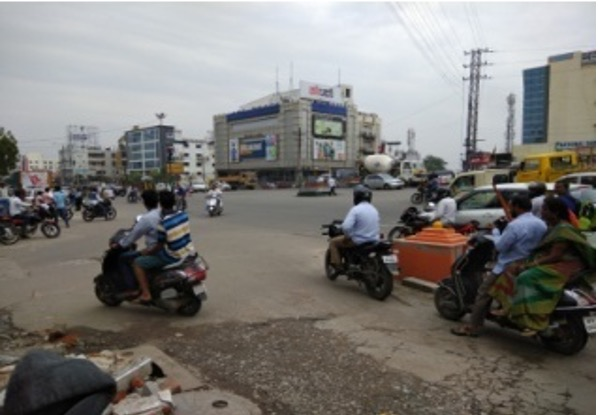
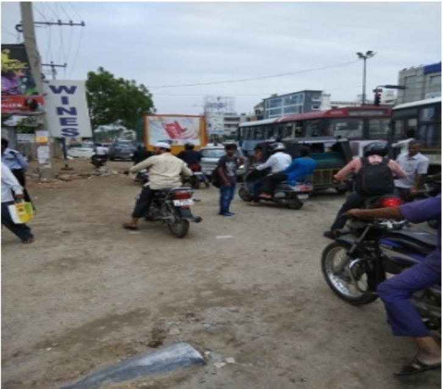
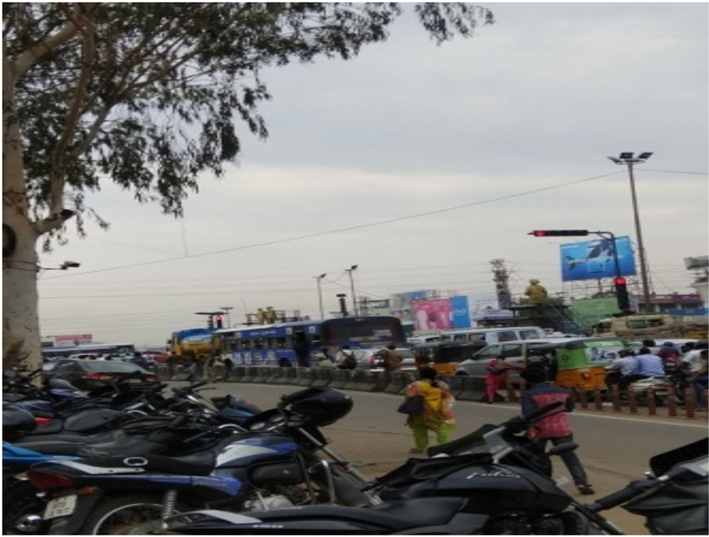
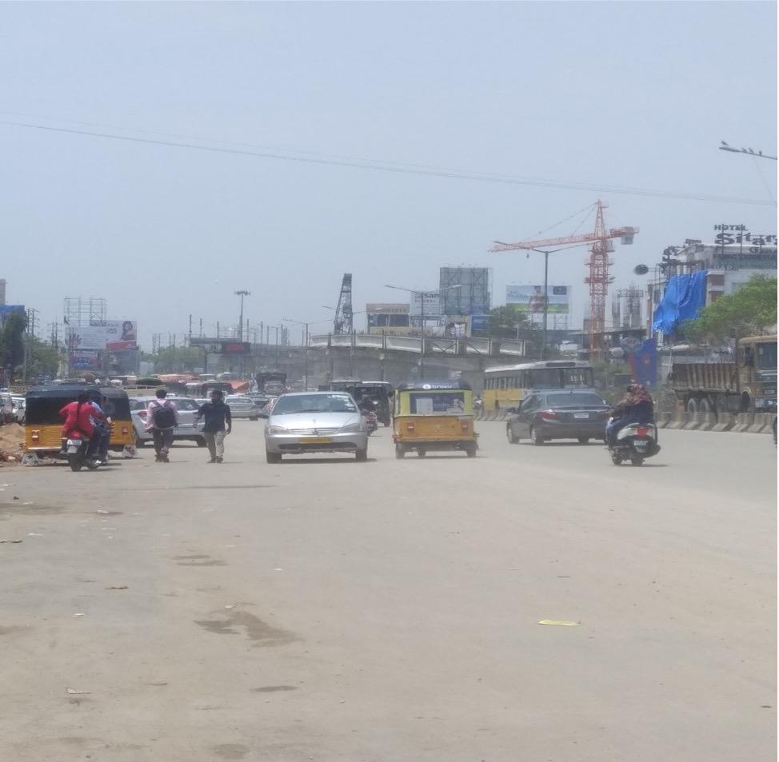
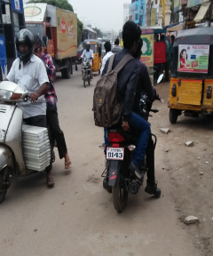
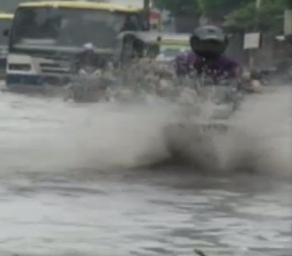
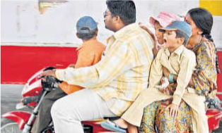
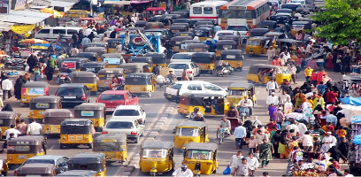
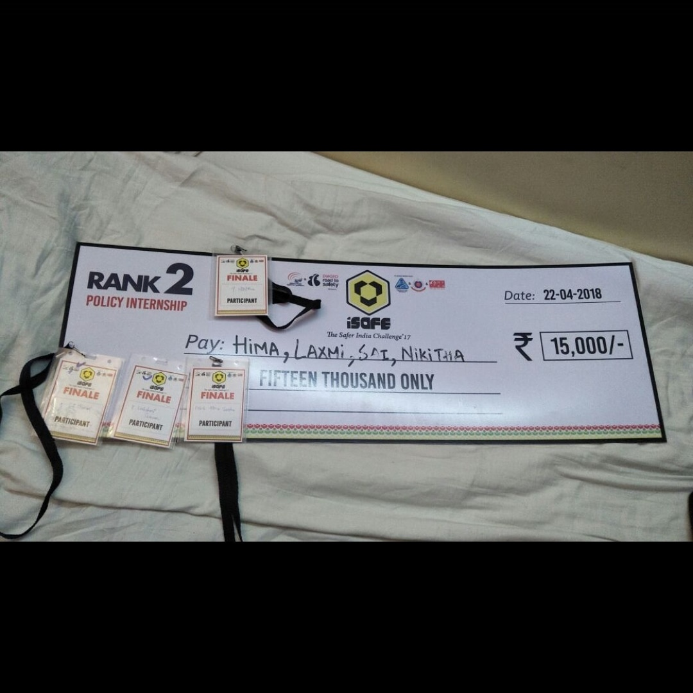

# Traffic Study
## About
**Event**: Watch the Road 2017     
**Organizer**: [Indian Road Safety Campaign](https://www.mygov.in/campaigns/national-road-safety/)    
**Competition**: National-level internship program involving multiple teams working on road safety challenges across India    
**Team Members**: Sai Kumar Aili, Hima Varsha Pulipaka, Lakshmi Sravani, Nikitha Y     
**Date**: 22 April 2018

## Problem Context and Importance
Hyderabad, one of India's largest metropolitan cities, faces significant road safety challenges due to rapid urbanization, population growth, and evolving traffic patterns. The study focuses on two critical areas: the Inner Ring Road (L.B Nagar to Uppal Ring Road) and National Highway 163 (Amberpet X Road to Uppal Ring Road). These areas experience high accident rates, inadequate infrastructure, and traffic management issues.    

YouTube: [Why Indian roads are the world's most dangerous?](https://youtu.be/s2lXjwJZ4Ls?si=xbbRK8a7XiryVvI7)

## Key Issues
- **High Accident Rates**: 51 accidents in 3 months (4 fatal), with 5-6 major accidents per week.
- **Infrastructure Deficiencies**: Poor drainage systems, damaged roads, lack of footpaths and bus shelters.
- **Traffic Violations**: Signal jumping, drunk driving, overspeeding, overtaking, and wrong-way driving.
- **Pedestrian Safety**: Lack of proper footpaths and foot over bridges.
- **Economic Impact**: Accidents lead to unsustainable losses in health and economy.

### Images
We have included images that illustrate the key issues identified during our study. These images highlight critical problems such as poor drainage, inadequate footpaths, and traffic congestion areas, providing a visual representation of the challenges faced by road users in Hyderabad.     

## Importance of the Study:
- **Public Safety**: Reduce fatalities and injuries through targeted interventions.
- **Urban Planning**: Provide data-driven insights for better infrastructure development.
- **Economic Benefits**: Minimize accident-related costs and improve traffic efficiency.
- **Scalability**: Serve as a model for other rapidly growing cities in India.

## Project Overview
This project contains findings from a multi-phase road safety study conducted in Hyderabad between July 2017 and April 2018. We utilized data analytics, statistical techniques, and geospatial analysis to identify patterns in road safety data and propose actionable solutions.

## Study Areas
- Inner Ring Road: L.B Nagar to Uppal Ring Road [17.3457° N, 78.5522° E](https://www.google.com/maps?q=17.3457,78.5522)
- National Highway 163: Amberpet X Road to Uppal Ring Road [17.3984° N, 78.5583° E](https://www.google.com/maps?q=17.3984,78.5583)

## Project Phases
### Phase 1: Initial Assessment
- Identified key problem areas using police records and site visits.
- Conducted preliminary data collection in Excel format.
### Phase 2: Detailed Analysis
- Performed in-depth analysis of accident causes and patterns.
- Surveyed commuters and collected First Information Reports (FIRs).
### Phase 3: Solution Development
- Proposed infrastructure improvements (e.g., footpaths, drainage systems).
- Developed traffic management strategies (e.g., sensor-operated signals).
### Phase 4: Implementation Planning
- Created detailed plans for implementing proposed solutions.
- Coordinated with local authorities for resource allocation.
### Phase 5: Evaluation and Reporting
- Assessed the impact of implemented solutions on accident rates.
- Compiled a final report with recommendations for future improvements.

## Data Collection and Statistical Techniques
### Data Collection:
1. Accident records from police stations.
2. Surveys from commuters about road conditions and traffic behavior.
3. Public transportation data and construction management reports.
4. Geospatial data for mapping accident hotspots.

### Statistical Techniques Used:
- **Descriptive Statistics**: Summarized accident frequency, severity, and contributing factors. Identified average accident rates across locations.
- **Time Series Analysis**: Analyzed trends in accidents over time (e.g., monthly or seasonal variations).
- **Regression Analysis**: Explored relationships between accidents and factors like weather, road conditions, and traffic volume.
- **Geospatial Analysis**: Used GIS tools to map accident hotspots and visualize high-risk areas.
- **Chi-Square Tests**: Examined associations between categorical variables (e.g., pedestrian involvement vs. location type).
- **ANOVA (Analysis of Variance)**: Compared accident rates across different times of day or locations.

## Challenges in Analyzing Road Safety Data
- **Data Quality Issues**: Inconsistent or missing data from various sources.
- **Heterogeneous Traffic Conditions**: Diverse vehicle types and behaviors complicate analysis.
- **Human Factors**: Difficulties quantifying driver behavior or pedestrian actions.
- **Environmental Factors**: Limited documentation of weather conditions or road maintenance status.
- **Integration of Data Sources**: Lack of standardized formats across agencies hinders comprehensive analysis.

## Results
### Key Findings:
- High accident rates caused by signal jumping, drunk driving, overspeeding, overtaking, and wrong-way driving.
- Poor infrastructure exacerbates risks during monsoon seasons.
### Proposed Solutions:
- Infrastructure improvements: Better drainage systems, footpaths, bus shelters.
- Traffic management strategies: Sensor-operated signals, stricter enforcement of rules.
- Awareness campaigns to improve compliance with traffic laws.
### Impact Assessment:
- Reduction in accident frequency post-intervention at key hotspots.

### Official Approval
We are pleased to announce that our work and proposed solutions for addressing traffic problems from Uppal X Roads to L.B Nagar Junction were officially approved by the GHMC Executive Engineer (T&T Division) in Dec 2017. This endorsement acknowledges the significance of our project, which focuses on addressing critical traffic problems from Uppal X Roads to L.B Nagar Junction.

## Requirements
- Access to police records and public transportation data.
- Excel for data analysis (e.g., regression models).

## Acknowledgments
We extend our gratitude to the Hyderabad Traffic Police, GHMC (Greater Hyderabad Municipal Corporation), and all local authorities who supported this study. Special thanks to the residents and commuters of L.B Nagar and Amberpet areas for their valuable input throughout the project.

## Conclusion
In conclusion, our project, **Watch the Road 2017**, conducted under the Indian Road Safety Campaign, successfully identified critical road safety issues in Hyderabad, particularly along the Inner Ring Road and National Highway 163. Through comprehensive data collection, statistical analysis, and community engagement, we were able to pinpoint the main causes of accidents and propose effective solutions aimed at improving road safety.

Our work not only highlighted the pressing need for infrastructure improvements and enhanced traffic management strategies but also emphasized the importance of public awareness regarding traffic rules. The recommendations made in this study, including the implementation of sensor-operated traffic signals and improved pedestrian facilities, aim to create a safer environment for all road users.

We are proud to announce that our project was ranked 2nd in the annual competition held by the Indian Road Safety Campaign, earning us a cash prize. This recognition reflects our commitment to addressing road safety challenges and our dedication to making a meaningful impact in our community.

